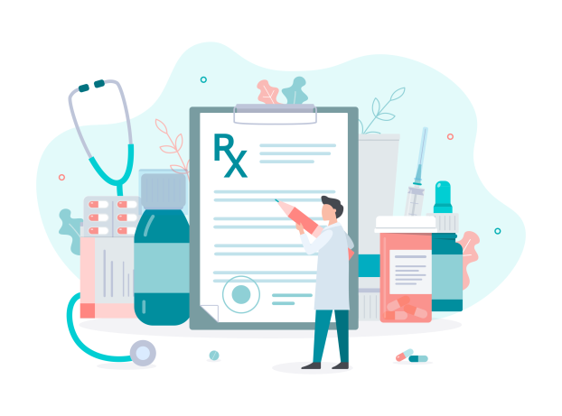

<section class="bg-white page-section py-5" role="main">
    <svg 
        preserveAspectRatio="xMidYMin slice" 
        class="shape-divider" 
        version="1.1" 
        xmlns="http://www.w3.org/2000/svg" 
        xmlns:xlink="http://www.w3.org/1999/xlink" 
        x="0px" 
        y="0px"
        viewBox="0 0 1034.2 43.8" 
        style="enable-background:new 0 0 1034.2 43.8;" 
        xml:space="preserve"
    >
	    <path fill="#ffffff" d="M0,21.3c0,0,209.3-48,517.1,0s517.1,0,517.1,0v22.5H0V21.3z"/>
    </svg>
    

        

            

                <h2 class="section-heading">Claims data can make medications safe and effective for more than <strong>22 million people</strong>.</h2>
                

            

        

        

            

                
            

            

                

                    Of the 65 million beneficiaries covered by Medicare programs, stand-alone Prescription Drug Plan Sponsors (PDPs) cover more than 22 million people. AB2D provides Medicare Parts A and B claims data to fill gaps in patients' health information for a holistic view that supports better care.
                

                <h2>What requirements led to AB2D?</h2>
                

                    The AB2D API (AB2D) supports government initiatives to improve patient health. The Centers for Medicare & Medicaid (CMS) developed AB2D to follow the <a href="https://www.congress.gov/bill/115th-congress/house-bill/1892/text" target="_blank">Bipartisan Budget Act of 2018 (BBA)</a> and <a target="_blank" href="https://www.federalregister.gov/documents/2019/04/16/2019-06822/medicare-and-medicaid-programs-policy-and-technical-changes-to-the-medicare-advantage-medicare">Final Rule</a>. This is in accordance with requirements to share claims data with PDPs who have active contracts.
                

                <h2>How does AB2D support these requirements?</h2>
                

                    AB2D provides PDPs with Medicare Parts A and B claims data. This data helps PDPs promote the best use of medications to improve health outcomes. AB2D utilizes the <a href="https://hl7.org/fhir/uv/bulkdata/export/index.html" target="_blank">Bulk Fast Healthcare Interoperability Resources (FHIR)</a> standard for exchanging healthcare information electronically in order to make data sharing efficient and secure.
                

            

        

    

</section>

<section 
    class="bg-light-blue page-section pt-20 pb-10" 
    role="region" 
    aria-label="API Comparison"
>
    <svg 
        preserveAspectRatio="xMidYMin slice" 
        alt="divider" 
        class="shape-divider flip" 
        version="1.1" 
        xmlns="http://www.w3.org/2000/svg" 
        xmlns:xlink="http://www.w3.org/1999/xlink" 
        x="0px" 
        y="0px"
        viewBox="0 0 1034.2 43.8" 
        style="enable-background:new 0 0 1034.2 43.8;" 
        xml:space="preserve"
    >
	    <path fill="#ffffff" d="M0,21.3c0,0,209.3-48,517.1,0s517.1,0,517.1,0v22.5H0V21.3z"/>
    </svg>
    

        

            

                <h3 class="section-heading text-center">CMS Claims-Based FHIR APIs</h3>
                

            

        

        

            

                

                    <strong class="ds-u-font-weight--bold">AB2D is one of several CMS APIs that offer Medicare claims data sharing in FHIR format:</strong>
                

                

                    The Beneficiary Claims Data API helps Alternative Payment Model participants who provide high quality, coordinated care by simplifying their access to bulk Medicare Part A, B, and D claims.
                

                <a href='https://bcda.cms.gov/' target="_blank">Visit BCDA</a>
                

                

                    The Blue Button 2.0 API enables beneficiaries to connect their Medicare claims data to the applications, services, and research programs they trust.
                

                <a href='https://bluebutton.cms.gov/' target="_blank">Visit BB 2.0</a>
                

                

                    The Data at the Point of Care API enables healthcare providers with claims data to fill-in gaps in patient history at the point of care and deliver high quality care to Medicare beneficiaries.
                

                <a href='https://dpc.cms.gov/' target="_blank">Visit DPC</a>
            

            
  

        

    

</section>